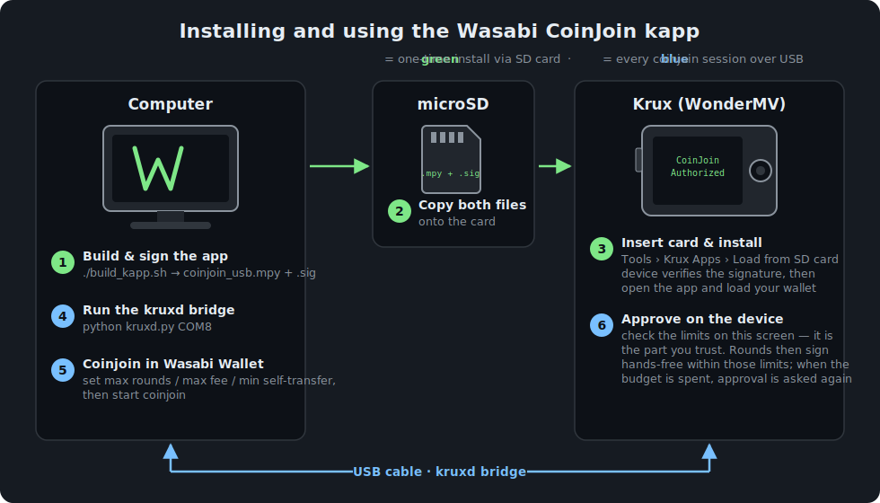

# Wasabi CoinJoin on your Krux

Coinjoin with [Wasabi Wallet](https://wasabiwallet.io) while your keys stay on
your [Krux](https://selfcustody.github.io/krux/) hardware device.

Normally Wasabi needs your keys on the computer to sign coinjoin rounds. With
this app your Krux does the signing instead, over a USB cable. You approve
**once** on the device — "at most N rounds, at most X sat/vB in fees" — and
the Krux then signs rounds automatically, but only rounds that stay inside
those limits. Anything else is refused by the device itself.

> **Status: experimental.** Works end-to-end on real hardware (WonderMV,
> regtest), but every part of the chain is still on unreleased branches.
> Do not point it at mainnet funds yet.



---

## What you need

| Part | What | Where |
|------|------|-------|
| A Krux device | e.g. WonderMV, M5StickV, Amigo | — |
| Krux firmware with app support | "kapps" firmware (not in official Krux yet) | [kravens/krux `kapps-develop`](https://github.com/kravens/krux/tree/kapps-develop) or [selfcustody/krux#485](https://github.com/selfcustody/krux/pull/485) |
| This app, compiled + signed | `coinjoin_usb.mpy` + `coinjoin_usb.mpy.sig` | build it yourself (below) — no signed release yet |
| Wasabi Wallet with Krux support | branch `feature/krux-coinjoin` | [kravens/WalletWasabi](https://github.com/kravens/WalletWasabi/tree/feature/krux-coinjoin) |
| kruxd | tiny bridge program: Wasabi ⇄ USB ⇄ Krux | [kravens/coinjoin.nl `kruxd/`](https://github.com/kravens/coinjoin.nl/tree/main/kruxd) |
| A microSD card | to carry the app onto the device | — |

Why so many pieces? Wasabi can't talk to a serial port directly, and your Krux
can't run apps unless its firmware supports them. Once the kapps framework and
the Wasabi branch are released, the list shrinks to: firmware, app, Wasabi.

## Step by step

### 1. Flash firmware that can run apps

Build and flash Krux from the `kapps-develop` branch. One extra step compared
to a normal Krux build: the firmware only runs apps signed by a key it trusts,
so put your signing key's public key in `src/krux/metadata.py` before building:

```python
KAPP_SIGNER_PUBKEYS = (
    "02....your compressed secp256k1 public key....",
)
```

(How to make that key: step 2. Flashing itself is the standard Krux procedure
for your device — see the [Krux docs](https://selfcustody.github.io/krux/getting-started/installing/).)

### 2. Build and sign the app

You need a signing key (any secp256k1 key — this is what step 1's pubkey came
from) and a Krux source tree that has been built once (for the `mpy-cross`
compiler):

```bash
# one-time: make a signing key
openssl ecparam -name secp256k1 -genkey -noout -out my_kapp_key.pem
# print the pubkey hex for KAPP_SIGNER_PUBKEYS in step 1:
openssl ec -in my_kapp_key.pem -pubout -conv_form compressed -outform DER 2>/dev/null | tail -c 33 | xxd -p -c 66

# compile + sign the app
./build_kapp.sh /path/to/krux-checkout my_kapp_key.pem
```

This produces `dist/coinjoin_usb.mpy` and `dist/coinjoin_usb.mpy.sig`.

### 3. Put the app on the Krux

1. Copy `coinjoin_usb.mpy` and `coinjoin_usb.mpy.sig` onto a microSD card.
2. SD card into the Krux, power it on.
3. In Krux settings, enable app loading: `Settings > Security > Load Krux app`.
4. On the start screen: `Tools > Krux Apps > Load from SD card` and pick
   `coinjoin_usb.mpy`. The device checks the signature, shows the SHA256, and
   stores the app internally.

### 4. Start the app and connect

1. Open the app: `Tools > Krux Apps > coinjoin_usb`. It first walks you
   through loading your mnemonic (the same one your Wasabi watch-only wallet
   is built from — same network and script type too).
2. Screen shows **"Waiting for Wasabi Wallet"**. The device is now serving
   over USB.
3. Plug the Krux into the computer, then start the bridge:

   ```bash
   python kruxd.py COM8        # your serial port; on Linux e.g. /dev/ttyUSB0
   ```

### 5. Coinjoin from Wasabi

1. In the Wasabi branch, import your Krux as a watch-only wallet
   (`importkruxwallet` RPC — see that branch's docs).
2. In the wallet's coinjoin settings, set your limits: **max rounds**,
   **max fee rate (sat/vB)**, **min self-transfer %**.
3. Start coinjoin. Wasabi sends your limits to the Krux; the Krux displays
   them and asks for confirmation. **Check the numbers on the device screen**
   — that screen is the thing you trust, not the computer.
4. Approve. The screen shows a green "CoinJoin Authorized" banner with a
   slowly breathing Wasabi logo. From here rounds are signed hands-free; the
   logo sweeps orange while a round is being signed.
5. When the approved number of rounds is used up, the session ends by itself
   and Wasabi has to ask again — new confirmation on the device.
6. Done? Press the Back button on the device (asks to confirm, then the
   device restarts — that's deliberate, see below).

## What keeps your money safe

The device never trusts the computer. Every round, before signing, the Krux
itself checks the actual transaction:

- **Only your inputs get signed.** Ownership is proven cryptographically
  (derivation must match the real scriptPubKey), not taken from labels the
  computer sends. After signing, a second check refuses to release anything if
  a foreign input somehow got a signature.
- **Your money must come back to you.** The self-transfer floor (e.g. 90%)
  means at most 10% of your input value may leave your wallet in any round —
  and the fee cap bounds it tighter than that in practice.
- **Hard device limits.** Even if you tap "yes" to a bad proposal, the device
  refuses: self-transfer floor below 50%, fee cap above 250 sat/vB, or more
  than 500 rounds are never accepted.
- **Only standard sighashes** (`SIGHASH_ALL` / default), so a malicious round
  can't use exotic signature modes to redirect funds later.
- **Session budget.** Every signed round counts down; at zero the
  authorization dies and physical re-approval is required.
- **Restart on exit.** When the app exits, the device reboots rather than
  dropping back into a possibly-tainted session (firmware rule for all kapps).

Worst case with a fully malicious computer: it can waste your approved
rounds' fee budget. It cannot redirect your coins.

## How the pieces talk

```
Wasabi Wallet  ──HTTP (localhost:21326)──  kruxd  ──USB serial──  Krux (this app)
```

- **Wasabi** builds the coinjoin PSBTs and asks for signatures.
- **kruxd** is a ~200-line Python bridge, same idea as Trezor's `trezord`:
  it owns the serial port and exposes four HTTP calls (`/info`, `/authorize`,
  `/proof`, `/sign`) on localhost only.
- **The app** on the Krux answers those calls: it shows the authorization
  prompt, produces SLIP-19 ownership proofs (Wasabi requires those to let
  UTXOs into a round), and signs PSBTs that pass all the checks above.

The USB protocol is 4 framed commands (`INFO`, `PROOF`, `SIGN`, `AUTHORIZE`);
frames start with the magic bytes `KXJ1` so console noise can't be mistaken
for data. The same flow works for plain batched multi-wallet transactions,
not just coinjoins.

## Repository layout

| Path | What |
|------|------|
| `kapps/coinjoin_usb.py` | the whole app — one self-contained file, as the kapps framework expects |
| `build_kapp.sh` | compile (`mpy-cross`) + sign helper |
| `tests/test_coinjoin_usb.py` | test suite for the app (run inside a Krux checkout, see header) |
| `HARDWARE_TEST.md` | notes for testing on a real device |
| `manifest.json` | metadata for the future [selfcustody/kapps](https://github.com/selfcustody/kapps) listing |
| `src/krux/extensions/`, `apply.py` | older approach (app baked into firmware); superseded by the kapp, kept for reference |

## Roadmap

- [x] End-to-end on real hardware: authorize → sign live coinjoin rounds → budget exhausted → re-authorize
- [ ] Kapps framework merged into official Krux ([#485](https://github.com/selfcustody/krux/pull/485))
- [ ] Krux support merged into Wasabi Wallet
- [ ] Signed release in [selfcustody/kapps](https://github.com/selfcustody/kapps) (maintainer signature + SHA256), so users skip the build steps entirely
